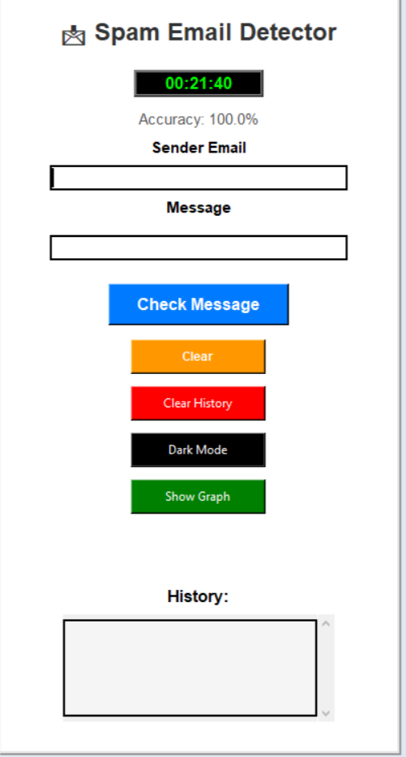
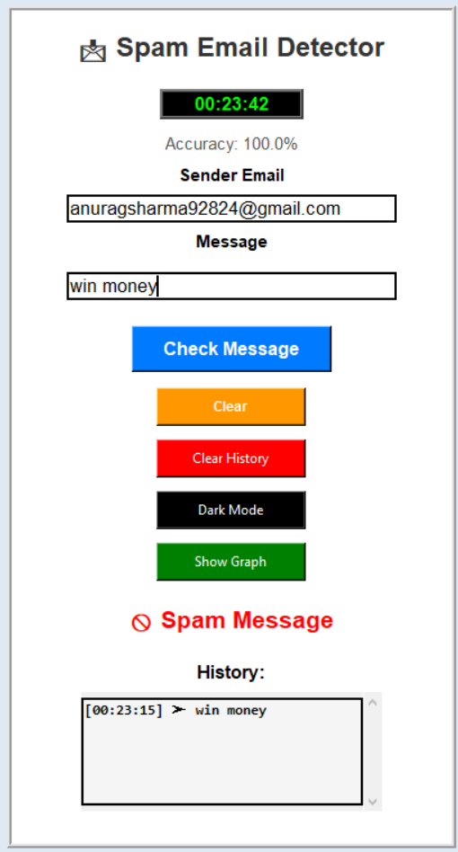
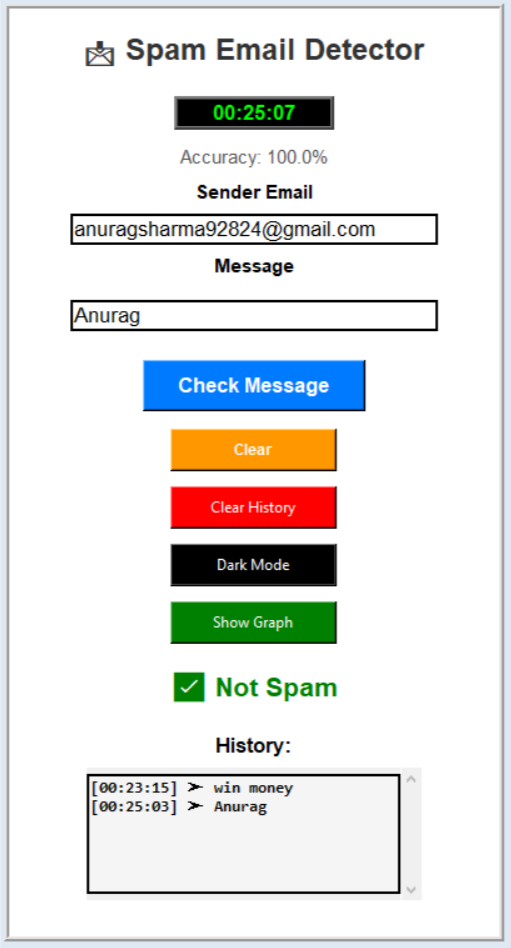
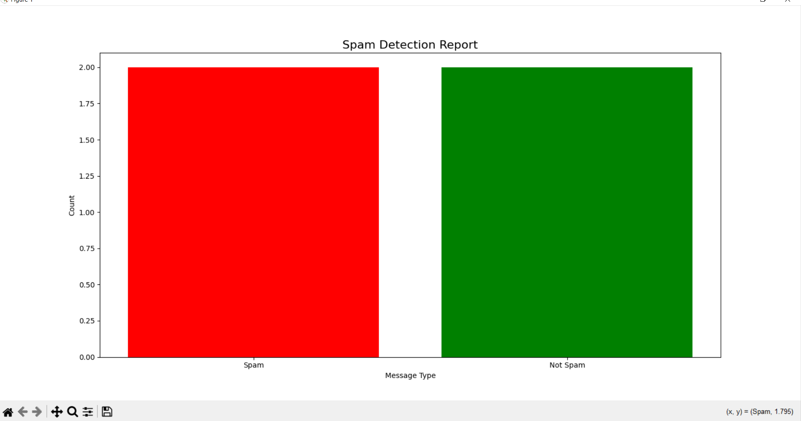
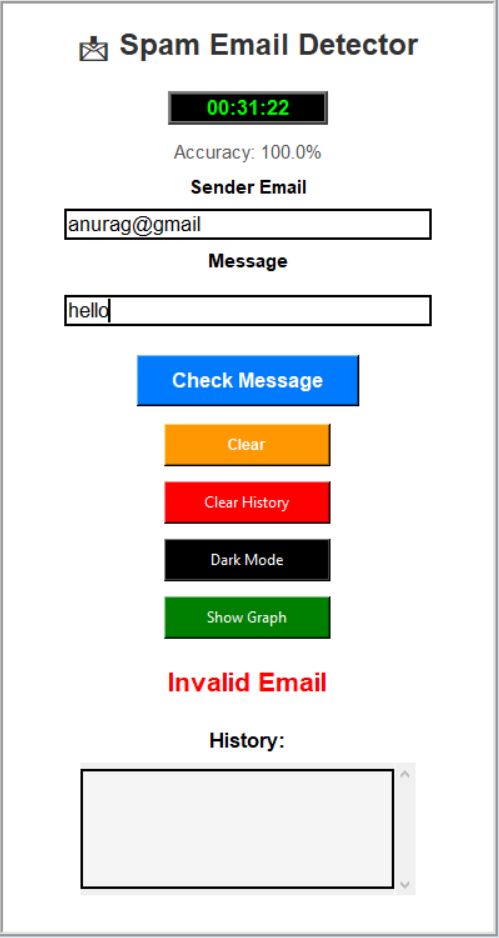
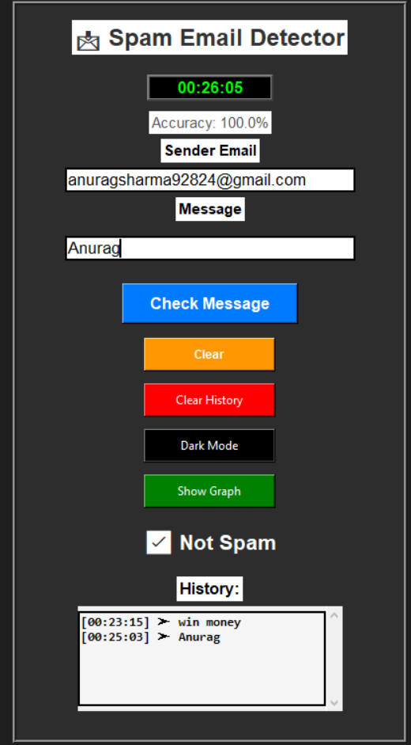

# 📩 Spam Email Detector

An intelligent Spam Detection System developed using Machine Learning and Python. The project uses the Multinomial Naive Bayes algorithm with CountVectorizer for real-time spam message classification through an interactive Tkinter-based graphical user interface.
---

## 🚀 Features
- Spam and Ham Message Detection
- Tkinter Graphical User Interface (GUI)
- Dark Mode Toggle
- Voice Output Accessibility
- Graphical Result Visualization
- Email Validation
- Automated CSV History Log Storage
- Real-Time Classification
- Live Digital Clock

---

## 🧠 Technologies Used
- Python
- Tkinter
- Scikit-learn
- CountVectorizer
- Multinomial Naive Bayes
- Pandas
- Matplotlib
- pyttsx3
- CSV

---

## 📊 Project Accuracy
- Achieved 100% accuracy during testing and interface validation.

---

## 🖼️ Screenshots
### Main GUI

### Spam Detection Output

### Safe Message Output

### Graph Visualization

### Email Validation

### Email Validation

---

## 📄 Research Paper
The research paper related to this project is included in this repository.

---

## ▶️ How to Run
1. Download or clone this repository.

2. Install required libraries:

pip install -r requirements.txt

3. Run the Python file:

python spam_detection.py

4. Enter a message in the GUI and click the detect button.

---

## 👨‍💻 Author
Anurag Sharma
